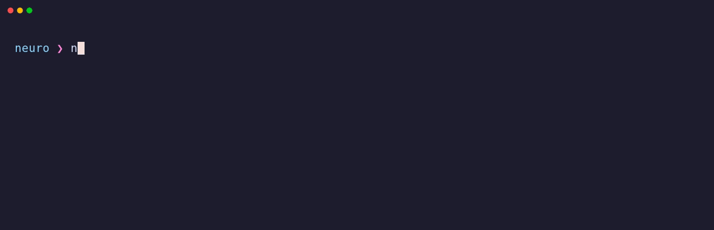

# Neuro Programming Language

> An AOT-compiled language for high-performance AI development.

<p align="center">
  
</p>

[](LICENSE)
[](https://neuro-docs.netlify.app/)
[](https://llvm.org/)
[](https://github.com/PanzerPeter/Neuro/actions/workflows/ci.yml)

**Status:** Alpha. Phase 1 (Core Language) is in progress, and finishing it ships v2.0.0. Per-sub-phase status lives in one place: the [Quick Roadmap](#quick-roadmap).

---

## Table of Contents

- [Overview](#overview)
- [Quick Example](#quick-example)
- [Current Capabilities](#current-capabilities)
- [Installation](#installation)
- [Usage](#usage)
- [Language Syntax](#language-syntax)
- [Architecture](#architecture)
- [Quick Roadmap](#quick-roadmap)
- [Development](#development)
- [VSCode Extension](#vscode-extension)
- [File Extensions](#file-extensions)
- [Contributing](#contributing)
- [License](#license)
- [Acknowledgments](#acknowledgments)
- [Security](SECURITY.md)
- [Code of Conduct](CODE_OF_CONDUCT.md)
- [Design Rationale](DESIGN.md)

---

## Overview

Neuro is an Ahead-of-Time (AOT) compiled language for AI workloads. Python is interpreted and leans on C libraries for anything fast; Neuro compiles to native code through an LLVM 20 backend instead. Planned on top of that backend:

- MLIR-based tensor operations, for static shape-verified tensor types
- IR-level automatic differentiation via Enzyme
- GPU acceleration via MLIR GPU dialects (nvgpu, rocdl, Triton)

---

## Quick Example

A single perceptron with ReLU activation; uses structs, `impl` blocks, associated functions, instance methods, if-expressions, and implicit returns. [This file compiles and runs today.](examples/structs/neuron.nr)

```neuro
struct Neuron {
    weight: f64,
    bias: f64
}

impl Neuron {
    func new(weight: f64, bias: f64) -> Neuron {
        Neuron { weight: weight, bias: bias }
    }

    // ReLU: pass-through if active, clamp to zero if not
    func activate(&self, input: f64) -> f64 {
        val z = (input * self.weight) + self.bias
        if z > 0.0 { z } else { 0.0 }
    }

    func is_active(&self, input: f64) -> bool {
        val z = (input * self.weight) + self.bias
        z > 0.0
    }
}

func main() -> i32 {
    val neuron = Neuron::new(0.5, -0.1)

    val dead   = neuron.activate(0.0)   // 0.0 * 0.5 − 0.1 = −0.1 → clamped to 0.0
    val active = neuron.activate(1.0)   // 1.0 * 0.5 − 0.1 =  0.4 → passes through
    val fired  = neuron.is_active(1.0)  // true

    return 0
}
```

---

## Current Capabilities

Every row below is implemented, tested, and usable today. Depth lives elsewhere: the [documentation site](https://neuro-docs.netlify.app/) and [docs/](docs/) for reference material, [CHANGELOG.md](CHANGELOG.md) for the per-release detail, and the [Quick Roadmap](#quick-roadmap) for what is still ahead.

| Feature | Summary |
|---|---|
| **Types & inference** | `i8` through `u64`, `f16`/`bf16`/`f32`/`f64`, `bool`, `char`, `string`; literal suffixes, digit separators, `as` casts, type aliases |
| **Functions & control flow** | Recursion, forward refs, implicit returns; `if`/`elif`/`else`, `while`, `loop`, range-`for`, labelled `break`/`continue`, block-as-value |
| **Generics** | Generic functions, structs, and impls plus const generics, `where` clauses, and turbofish, all fully monomorphized at zero runtime cost |
| **Traits & dispatch** | Required and default methods, operator traits, `impl Trait` (static) and `dyn Trait` (vtable) dispatch with object-safety checks |
| **Closures & lambdas** | `\|x: i32\| x * x`, `move` closures, `(T) -> R` function types, higher-order functions; compiled to `{ fn_ptr, env_ptr }`, no heap |
| **Structs & methods** | Fields, shorthand init, functional update `..base`, `impl` blocks with `&self` / `&mut self` methods and associated functions |
| **Enums & newtypes** | Unit, tuple, and struct-field variants; generic enums monomorphized per type argument; `newtype` for distinct nominal wrappers |
| **Arrays, tuples & collections** | Fixed-size `[T; N]` and anonymous tuples over `Copy` elements; heap-backed `Vec<T>`, `HashMap<K, V>`, `BTreeMap<K, V>` that move on assignment and free at scope exit |
| **Pattern matching** | Exhaustive `match` expressions over variant / literal / or / range / wildcard patterns with `if` guards, plus `val Point { x, y } = p` and `val [a, ..rest] = arr` destructuring |
| **`Option` / `Result`** | `Option<T>` and `Result<T, E>` from the implicit prelude. They are ordinary generic enums, available with no declaration and no import, variants included; `??` unwraps either with a lazy fallback; `?` propagates the failure to the caller; `val-else` unwraps or exits the scope; `checked_add` / `checked_sub` / `checked_mul` report integer overflow as `Option::None` |
| **Ownership & borrows** | Move-by-default, `Copy`, deterministic `Drop`, `&T` / `&mut T` with flow-sensitive exclusivity, lifetime elision and annotations |
| **Strings** | Fat-pointer `string` with escapes, `&string` slices, `==`, `+` concatenation, `.len()` / `.clone()` / `.slice(a..b)`, interpolation `"{x:.2}"`, triple-quoted `"""` blocks with dedent |
| **Modules & visibility** | Multi-file programs: every `.nr` file is a module and `mod.nr` directories nest; inline `module { }` blocks group within one file; `import math::{sqrt}`, `import ./utils`, `as` renames, module aliases, variant imports, and `export import` re-export facades; declarations and struct fields are private until `export` opts them in; an implicit prelude puts `Option` / `Result` and `Some` / `None` / `Ok` / `Err` in every module, with `@no_prelude` to opt out |
| **Toolchain** | Native binaries via inkwell 0.9 / LLVM 20; `neurc check` and `neurc compile`; `panic` / `assert` / `unreachable` runtime, with error paths outlined off the hot path |

### Current Memory Model

> **Alpha memory warning.** Stack values are reclaimed on return and string literals live in `.rodata`, so neither leaks. Move semantics, borrows, deterministic `Drop`, and the owning collections have landed, so a `Vec`, `HashMap`, or `BTreeMap` frees its buffer at scope exit. Two gaps remain: `+` string concatenation still leaks its heap buffer, and a `string` stored inside a collection is not freed with it, because the growable heap-string type has not landed.
>
> This block is removed once that type lands. Until then, do not assume memory-safety semantics beyond what the table above claims.
>
> If memory-safety semantics and compiler backend design are your thing, **[this is exactly where contributors are needed](CONTRIBUTING.md)**.

---

## Installation

### Prerequisites

| Requirement | Version | Notes |
|---|---|---|
| **Rust** | 1.85+ | Install via [rustup](https://rustup.rs/) |
| **LLVM 20** | 20.x with dev libs | Platform instructions below |
| **C linker** | any | `gcc`/`clang` on Linux/macOS; MSVC on Windows |

---

### Arch Linux / CachyOS

```bash
# 1. Install LLVM 20
sudo pacman -S llvm20

# 2. Install Rust
curl --proto '=https' --tlsv1.2 -sSf https://sh.rustup.rs | sh
source ~/.cargo/env

# 3. Set the LLVM prefix (add to ~/.bashrc or ~/.zshrc to persist)
export LLVM_SYS_201_PREFIX=/usr/lib/llvm20

# 4. Clone and build
git clone https://github.com/PanzerPeter/Neuro.git
cd Neuro
cargo build --release

# 5. Run the test suite
cargo test --workspace

# 6. (Optional) Install the compiler globally
cargo install --path compiler/neurc
```

### Ubuntu / Debian

```bash
# 1. Install LLVM 20 via the official APT script
wget -qO- https://apt.llvm.org/llvm.sh | sudo bash -s -- 20
# Alternatively, use the full dev package set:
# sudo apt-get install llvm-20 llvm-20-dev llvm-20-tools libpolly-20-dev

# 2. Install Rust
curl --proto '=https' --tlsv1.2 -sSf https://sh.rustup.rs | sh
source ~/.cargo/env

# 3. Set the LLVM prefix (add to ~/.bashrc to persist)
export LLVM_SYS_201_PREFIX=/usr/lib/llvm-20
echo 'export LLVM_SYS_201_PREFIX=/usr/lib/llvm-20' >> ~/.bashrc

# 4. Clone and build
git clone https://github.com/PanzerPeter/Neuro.git
cd Neuro
cargo build --release

# 5. Run the test suite
cargo test --workspace

# 6. (Optional) Install the compiler globally
cargo install --path compiler/neurc
```

### macOS (Homebrew)

```bash
# 1. Install LLVM 20
brew install llvm@20

# 2. Install Rust
curl --proto '=https' --tlsv1.2 -sSf https://sh.rustup.rs | sh
source ~/.cargo/env

# 3. Set the LLVM prefix (add to ~/.zshrc or ~/.bash_profile to persist)
export LLVM_SYS_201_PREFIX="$(brew --prefix llvm@20)"
echo "export LLVM_SYS_201_PREFIX=$(brew --prefix llvm@20)" >> ~/.zshrc

# 4. Clone and build
git clone https://github.com/PanzerPeter/Neuro.git
cd Neuro
cargo build --release

# 5. Run the test suite
cargo test --workspace

# 6. (Optional) Install the compiler globally
cargo install --path compiler/neurc
```

### Windows 10 / 11 (x64)

Windows requires the **MSVC toolchain** (not GNU). Make sure Visual Studio Build
Tools 2019 or later are installed with the **C++ build tools** workload before
proceeding.

**Step 1. Install Visual Studio Build Tools**

Download from [visualstudio.microsoft.com/downloads](https://visualstudio.microsoft.com/downloads/)
→ *Tools for Visual Studio* → *Build Tools for Visual Studio 2022*.
Select the **Desktop development with C++** workload.

**Step 2. Install Rust**

Download and run `rustup-init.exe` from [rustup.rs](https://rustup.rs/).
When prompted, choose *1) Proceed with standard installation*. Rustup will
automatically select the `stable-x86_64-pc-windows-msvc` default toolchain.

Open a **new** PowerShell window after installation so the `cargo` and `rustc`
commands are on your `PATH`.

**Step 3. Install LLVM 20**

Download the official Windows installer from the LLVM GitHub releases page:

```powershell
# PowerShell: download and run the installer silently
$version = "20.1.8"
$url = "https://github.com/llvm/llvm-project/releases/download/llvmorg-$version/LLVM-$version-win64.exe"
curl.exe -fsSL -o "$env:TEMP\llvm-installer.exe" $url
Start-Process "$env:TEMP\llvm-installer.exe" -ArgumentList "/S /D=C:\LLVM" -Wait -PassThru | Out-Null
```

Or download and run the installer manually from the
[LLVM GitHub releases page](https://github.com/llvm/llvm-project/releases), installing to `C:\LLVM`
(the path must not contain spaces; the NSIS installer enforces this).

**Step 4. Set the LLVM environment variable**

```powershell
# Set permanently for your user account (no admin required)
[Environment]::SetEnvironmentVariable(
    "LLVM_SYS_201_PREFIX", "C:\LLVM",
    [EnvironmentVariableTarget]::User
)
# Also add C:\LLVM\bin to your PATH
$current = [Environment]::GetEnvironmentVariable("Path", "User")
[Environment]::SetEnvironmentVariable("Path", "$current;C:\LLVM\bin", "User")
```

Close and reopen PowerShell so the changes take effect, then verify:

```powershell
llvm-config --version   # should print 20.x.y
```

**Step 5. Clone and build**

```powershell
git clone https://github.com/PanzerPeter/Neuro.git
cd Neuro
cargo build --release
```

**Step 6. Run the test suite**

```powershell
cargo test --workspace
```

**Step 7. (Optional) Install the compiler globally**

```powershell
cargo install --path compiler/neurc
# The binary is placed in %USERPROFILE%\.cargo\bin\neurc.exe
# which is already on PATH after rustup setup.
```

> **Troubleshooting Windows build errors**
>
> - *`llvm-sys` build script cannot find LLVM*: confirm `LLVM_SYS_201_PREFIX`
>   is set in the **current** shell session (`echo $env:LLVM_SYS_201_PREFIX`)
>   and points to a directory that contains `bin\llvm-config.exe`.
> - *`link.exe` not found*: the MSVC Build Tools are not on `PATH`. Run the
>   build from a **Developer PowerShell** / **x64 Native Tools Command Prompt**
>   or install the *C++ build tools* workload as described in Step 1.
> - *Version mismatch (`llvm-sys-201` requires LLVM 20)*: an older LLVM is on
>   `PATH`. Set `LLVM_SYS_201_PREFIX` explicitly to the LLVM 20 prefix and
>   ensure `C:\LLVM\bin` precedes any other LLVM entries in `PATH`.

---

## Usage

```bash
# Type-check a source file (no binary produced)
cargo run -p neurc -- check examples/basics/hello.nr

# Compile to a native executable
cargo run -p neurc -- compile examples/basics/factorial.nr

# Run the compiled binary (emitted next to the source file)
./examples/basics/factorial

# After cargo install --path compiler/neurc:
neurc compile examples/basics/factorial.nr
```

---

## Language Syntax

### Variables and Types

```neuro
// Immutable by default
val x: i32 = 42
val name: string = "Neuro"

// Mutable with reassignment
mut counter: i32 = 0
counter = counter + 1

// Type inference works for both val and mut
val pi = 3.14159   // inferred f64
val n  = 100       // inferred i32
mut count = 0      // inferred i32; type annotation optional
```

### Functions

```neuro
// Explicit return
func add(a: i32, b: i32) -> i32 {
    return a + b
}

// Expression-based implicit return (trailing expression)
func multiply(a: i32, b: i32) -> i32 {
    a * b
}
```

### Control Flow

```neuro
func fizzbuzz(n: i32) -> i32 {
    mut i: i32 = 1
    while i <= n {
        i = i + 1
    }
    i
}

func sum(n: i32) -> i32 {
    mut total: i32 = 0
    for i in 0..n {
        total = total + i
    }
    total
}
```

### Structs

```neuro
struct Point {
    x: f64,
    y: f64
}

func distance(p: Point) -> f64 {
    // field read
    val dx = p.x
    val dy = p.y
    dx * dx + dy * dy   // placeholder (no sqrt yet)
}

func main() -> i32 {
    val origin = Point { x: 0.0, y: 0.0 }

    // field mutation requires mut binding
    mut cursor = Point { x: 3.0, y: 4.0 }
    cursor.x = 1.0

    return 0
}
```

### Closures and Higher-Order Functions

Verbatim from [examples/showcase/closures.nr](examples/showcase/closures.nr). It compiles, links, and exits with code 90.

```neuro
// Apply `f` to each element of a 4-element array and sum the results.
func map_sum(xs: [i32; 4], f: (i32) -> i32) -> i32 {
    mut total: i32 = 0
    mut i: i32 = 0
    while i < 4 {
        total += f(xs[i])
        i += 1
    }
    return total
}

struct Scaler {
    factor: i32
}

impl Scaler {
    func apply(&self, x: i32) -> i32 {
        x * self.factor
    }
}

func main() -> i32 {
    val data: [i32; 4] = [1, 2, 3, 4]

    // A closure capturing a Copy local (`bias`) by value.
    val bias = 10
    val biased = map_sum(data, |x: i32| x + bias)   // 11+12+13+14 = 50

    // A `move` closure with a block body and early return.
    val scale = 3
    val scaled = map_sum(data, move |x: i32| -> i32 {
        val y = x * scale
        return y
    })                                              // 3+6+9+12 = 30

    // A struct method still resolves alongside closures.
    val s = Scaler { factor: 2 }
    val doubled = s.apply(5)                         // 10

    biased + scaled + doubled                        // 50 + 30 + 10 = 90
}
```

Every runnable program in [examples/showcase/](examples/showcase/) combines several features at once and is pinned to an expected exit code in [examples/expected.txt](examples/expected.txt). Tensor types, `@grad`, and GPU kernels are not shown here because they do not exist yet. See the [Quick Roadmap](#quick-roadmap).

---

## Architecture

Neuro follows Vertical Slice Architecture (VSA): the code is organized by language feature, not by technical layer.

### Workspace Layout

```
compiler/
├── infrastructure/          # Shared, zero-business-logic crates
│   ├── ast-types/           #   AST node definitions
│   ├── diagnostics/         #   Error / warning types + rendering
│   ├── project-config/      #   Project / manifest configuration
│   ├── shared-types/        #   Primitives shared across slices
│   ├── source-location/     #   Spans, positions, source files
│   └── neuro-hir/           #   Typed High-Level IR (frontend ↔ backend contract)
├── lexical-analysis/        # Tokenizer (logos, Unicode XID)
├── syntax-parsing/          # Pratt + statement parser → AST
├── semantic-analysis/       # Type checker, scope analysis
├── control-flow/            # CFG builder (not yet active)
├── hir-lowering/            # Type-checked AST → typed HIR
├── llvm-backend/            # HIR → object code (inkwell 0.9 / LLVM 20)
├── mlir-backend/            # HIR → MLIR scaffold (off-by-default `mlir` feature)
└── neurc/                   # CLI compiler driver (pipeline orchestration)
```

### Compilation Pipeline

**Current (Phase 1):**
```
Source (.nr)
  → Lexical Analysis   (tokens)
  → Syntax Parsing     (AST)
  → Semantic Analysis  (type-checked AST)
  → HIR Lowering       (typed High-Level IR, neuro-hir)
  → LLVM Backend       (object code via inkwell / LLVM 20)
  → System Linker      (native executable)
```

**Planned extension (Phase 2+):**
```
Tensor/AI path: typed High-Level IR (neuro-hir)
  → MLIR (linalg/tensor/func/arith, LLVM 20 / MLIR 20)
  → Enzyme MLIR AD pass (@grad)
  → GPU dialects (nvgpu/rocdl/Triton) or llvm dialect
  → inkwell → native code
```

---

## Quick Roadmap

Each numbered phase is a MAJOR-version milestone: completing **Phase N** ships **v(N+1).0.0**. We are in **Phase 1** (v1.x), divided into lettered sub-phases.

| Phase | Goal | Status |
|:---:|---|:---:|
| **1** | **Core Language**: the full general-purpose language. Finishing it ships **v2.0.0** | In progress |
| 1A | Core MVP: types, functions, control flow, LLVM backend | Complete |
| 1B | Syntax and semantics stabilization: parser fixes, `const`, `as` casts, compound assignment, bitwise ops, integer suffixes, if/block expressions, `while true` lint, IEEE-754 float comparisons, string fat pointers | Complete |
| 1C | Ownership and borrow checker: move semantics, `Copy`, `&T`, `&mut T`, borrow exclusivity, lifetime elision / returned-reference outlives, `&mut self` methods, deterministic `Drop` | Complete ¹ |
| 1D | Backend plumbing: `neuro-hir` typed IR crate, `melior` integration, AST → HIR lowering, HIR-routed LLVM backend, mlir-backend HIR scaffold | Complete |
| 1E | Type system: arrays, tuples, structs, methods, destructuring, type aliases, enums, pattern matching, newtypes | Complete |
| 1F | Generics, traits and dispatch: generics, explicit lifetimes, trait declarations, operator traits, static/dynamic dispatch (`impl`/`dyn`), closures | Complete |
| 1G | Error handling, modules and prelude: `Option`/`Result`, collections, `checked_*`, `??`, `val-else`, `?`, error-path outlining, multi-file modules, imports, `export` visibility, inline modules & re-exports, implicit prelude | Complete |
| 1H | Language cleanup: string interpolation, triple-quoted strings, nested comments, named arguments | In progress |
| **2** | Tensors and MLIR: `Tensor<T, [...]>`, shape generics, named dims, dynamic shapes, DLPack, MLIR linalg lowering, pool allocator, pipeline `|>`, composition `>>`, einstein notation | Planned |
| **3** | Automatic differentiation: Enzyme MLIR pass, `@grad(wrt: ...)`, `.backward()` / `.zero_grad()`, higher-order derivatives, SGD | Planned |
| **4** | GPU acceleration: MLIR GPU dialects (nvgpu / rocdl / Triton), `@gpu`, `KernelOut<T>` aliasing model, device memory pool, CPU fallback | Planned |
| **5** | Neural network standard library: `TrainableTensor`, `ParameterList`, optimizers, `@model`, Dense / Conv2d / Attention, `.nrm` serialization | Planned |
| **6** | Async runtime: `async func`, `Future<T>`, `spawn`, `JoinHandle`, `join` / `race`, executor for data-loader / I/O overlap | Planned |
| **7** | Interop and advanced features: Python FFI via DLPack, spread operator, advanced pattern matching, custom attributes, `defer` | Planned |
| **8** | Developer experience: Language Server Protocol, diagnostics polish, formatter, `@test` runner | Planned |
| **9** | Package manager and distribution: `neurpm`, cross-OS installer / uninstaller / self-updater, signed release binaries, optimization passes (loop unrolling, AD-aware inlining, LTO) | Planned |

¹ Sub-phase 1C is essentially complete; one flagged item (growable runtime strings) remains and needs a decision on where it lands, because the sub-phase it was provisionally aimed at has since closed.

---

## Development

Set `LLVM_SYS_201_PREFIX` for your platform before running any Cargo command
(see [Installation](#installation) for the correct path per OS).

```bash
# Build the full workspace
cargo build --workspace

# Run all tests
cargo test --workspace

# Lint
cargo clippy --workspace --all-targets -- -D warnings

# Format check
cargo fmt --all -- --check

# Apply formatting
cargo fmt --all
```

On Windows, use PowerShell or a Developer Command Prompt. The env var must be
set in the current session; prefix it inline if needed:

```powershell
$env:LLVM_SYS_201_PREFIX = "C:\LLVM"
cargo build --workspace
```

---

## VSCode Extension

Syntax highlighting for `.nr` files is included in `neuro-language-support/`.

```bash
cd neuro-language-support
npm install -g @vscode/vsce
vsce package
# Install the generated .vsix via: VSCode → Extensions → Install from VSIX
```

---

## File Extensions

| Extension | Purpose |
|---|---|
| `.nr` | Neuro source files |
| `.nrl` | Compiled library modules |
| `.nrm` | Serialized model/matrix data |
| `.nrp` | Package definitions |

---

## Contributing

See [CONTRIBUTING.md](CONTRIBUTING.md) for architecture guidelines, coding standards, and the pull request process. Confirmed open defects live in [docs/BUGS.md](docs/BUGS.md) — fixing one is the best way to start.

The project is in early alpha, so breaking changes are expected. Contributions should focus on **Phase 1 (Core Language)**; the [Quick Roadmap](#quick-roadmap) marks which sub-phase is currently open.

---

## Why Neuro?

AI development is stuck in a fragmented paradigm: developers iterate in an interpreted glue language (Python), while underlying libraries are written in unmanaged, safety-critical systems languages (C++/CUDA). 

Neuro is built to unify this stack:
1. **True native performance.** Compiled AOT via LLVM 20, with no heavy runtime interpreter and no global interpreter lock (GIL).
2. **AI-First Type System:** Native compile-time shape verification for tensors using MLIR (Phase 2), preventing runtime dimension mismatches before a single line of training executes.
3. **Immutability by Default:** A modern `val`/`mut` paradigm to ensure highly parallelized tensor computations are thread-safe by design.

---

## License

Licensed under the [Neuro Shared Source License v2.1](LICENSE).

**Why not MIT/Apache 2.0 right now?** Neuro is in a critical pre-stabilization phase. The license protects against three specific risks: commercial re-packaging of the compiler before the language spec is stable, AI-assisted reproduction of the compiler for a competing product, and misleading forks that fragment the early ecosystem. None of these restrictions affect normal use.

**What you can do freely:**
- Use, study, and modify the compiler for any personal or internal purpose
- Write Neuro programs and distribute or sell the compiled output under **any** terms you choose. programs you compile are wholly exempt from this license
- Build tools, plugins, and editor integrations that call into the compiler
- Contribute code back to the project

**What requires a commercial license:**
- Redistributing the Neuro compiler itself (or a fork of it) as part of a commercial product

See [LICENSE](LICENSE) for full terms.

## Acknowledgments

Inspired by Rust (ownership, type system), Python (AI ecosystem simplicity), Swift (language ergonomics), and Mojo (AI-first design). Built with [inkwell](https://github.com/TheDan64/inkwell), [logos](https://github.com/maciejhirsz/logos), and the [LLVM](https://llvm.org/) infrastructure.